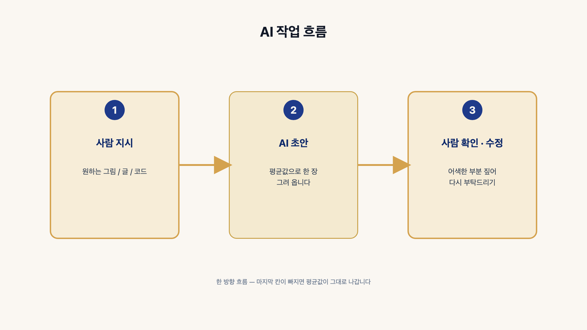
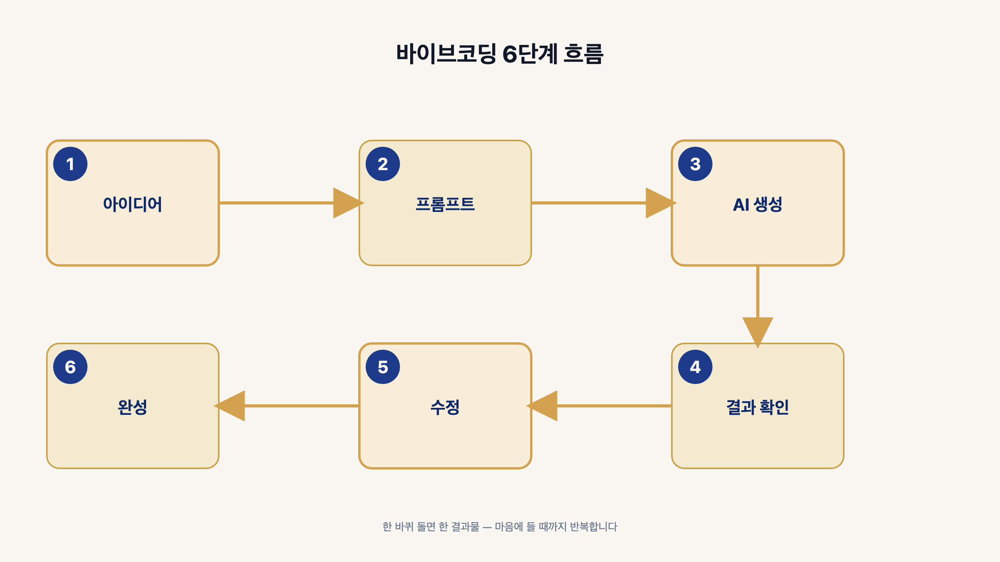
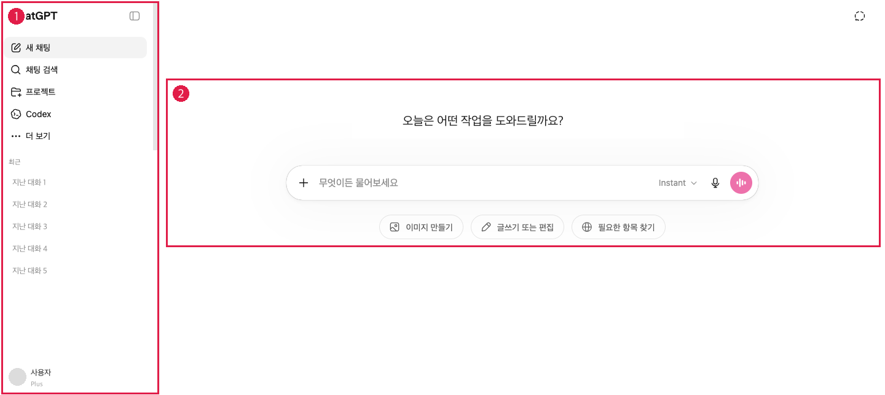
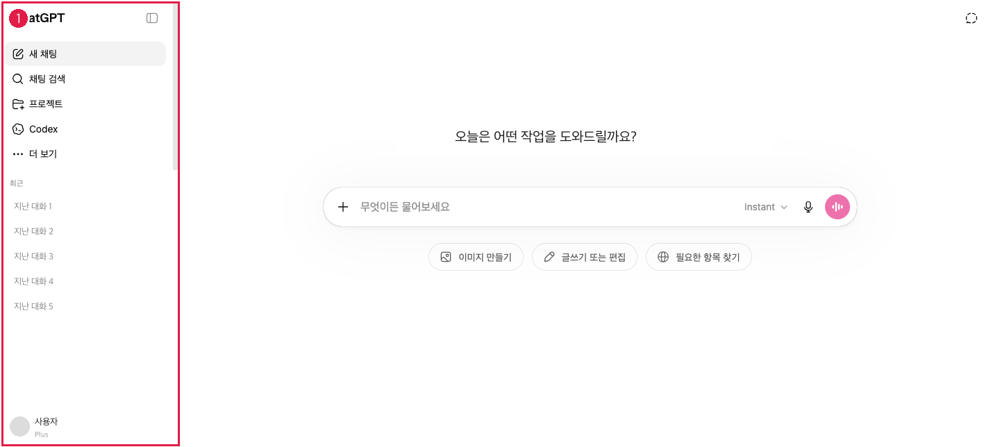
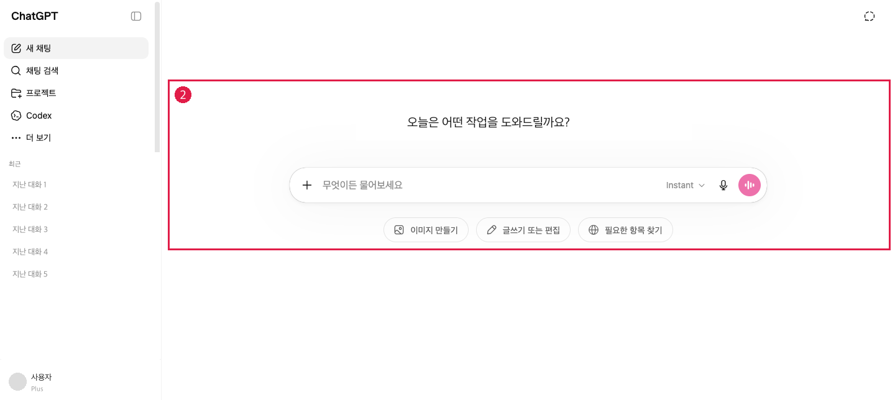
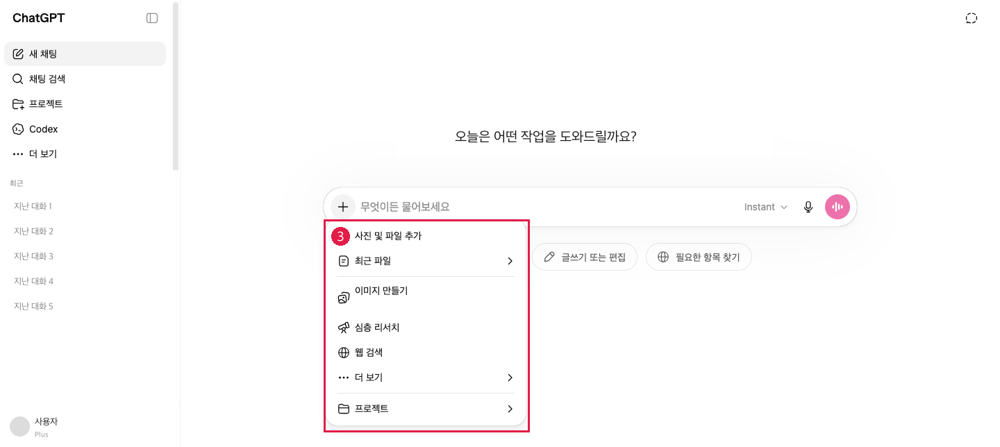
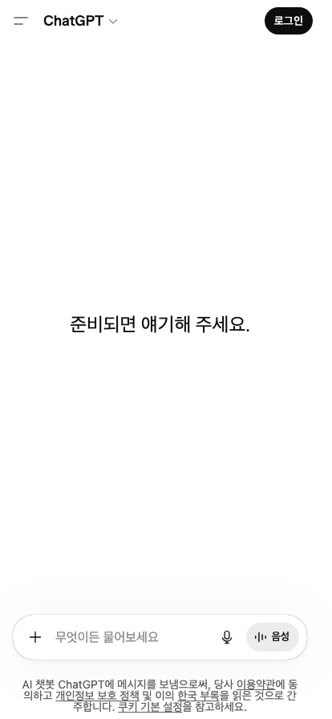
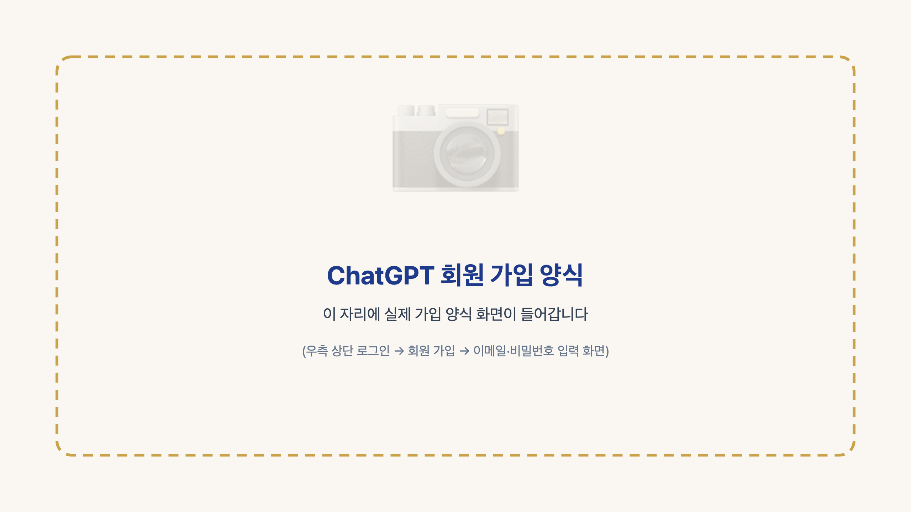
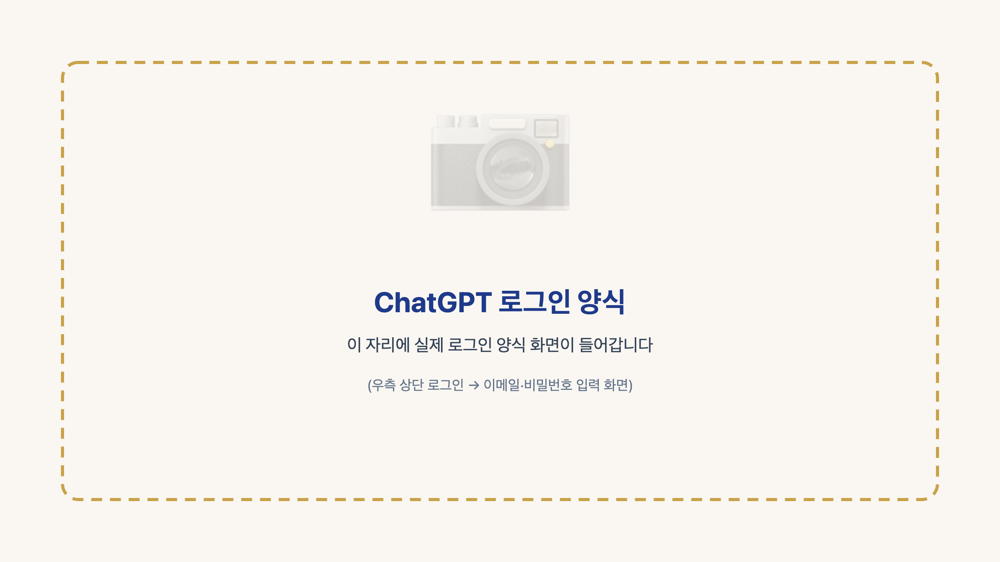
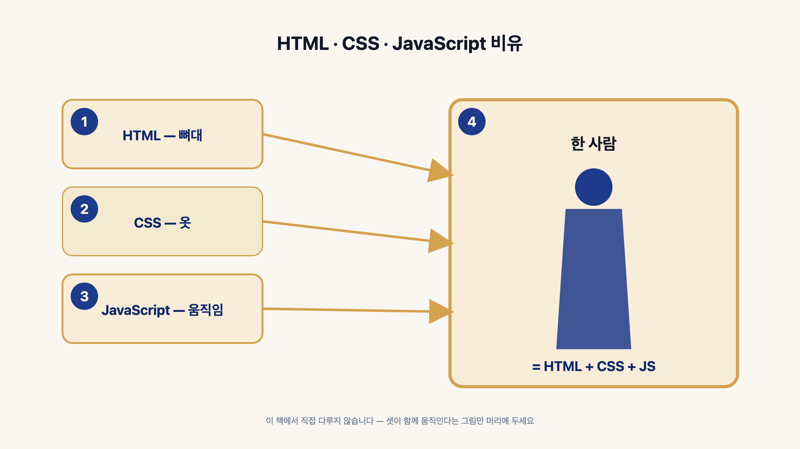

<!-- p4 — Unit B-0: Chapter 1 오프너 -->

# Chapter 1. AI · 바이브코딩 · ChatGPT 기본 이해

재료는 셋입니다.
**AI, 바이브코딩, ChatGPT** 입니다.

다음 챕터에서 이 셋으로 타로 사이트를 만듭니다.

<!-- p4 — Unit B-1: 절 1 AI란 무엇인가 -->

## 1. AI 란 무엇인가

여기서 다루는 AI 는 **한 줄로 부탁하면 초안을 그려 주는 견습 일러스트레이터** 입니다.

흐름은 세 칸입니다.
**사람이 부탁 → AI 초안 → 사람이 다듬기**.

AI 는 도구입니다.
결정은 여러분이 합니다.

<!-- p5 — Unit B-2: 절 2 바이브코딩이란 무엇인가 -->

## 2. 바이브코딩이란 무엇인가

바이브코딩은 **말로 부탁해 결과물을 받고, 마음에 들 때까지 다듬는 방식** 입니다.

흐름은 여섯 칸입니다.
**아이디어 → 부탁 → AI 생성 → 확인 → 수정 → 완성**.

식당을 떠올려 주십시오.
손님은 칼을 들지 않습니다.
주문하면 셰프가 한 그릇을 내옵니다.
간이 안 맞으면 다시 부탁하시면 됩니다.

<!-- p6 — Unit B-3-A: 절 3 ChatGPT 첫 화면 한눈에 -->

## 3. ChatGPT 화면 구성과 기능별 사용법

ChatGPT 는 **글로 부탁하면 글로 답해 주는 비서** 한 명입니다.

### (1) 첫 화면 한눈

볼 자리는 두 곳입니다.
**왼쪽 사이드바**와 **가운데 대화창** 입니다.

사이드바는 지난 대화 보관함입니다.
대화창은 오늘 일을 부탁하는 자리입니다.

대화창 아래에 입력창이 있습니다.
입력창 왼쪽 끝에 작은 **+ 단추** 가 있습니다.

<!-- p7 — Unit B-3-B: 절 3 ① 사이드바 -->

### (2) 사이드바 — 대화 보관함

**새 채팅** 은 새 책을 펴는 자리입니다.
**채팅 검색** 은 옛 책을 다시 꺼내는 자리입니다.

결이 같은 작업은 한 채팅 안에서 이어 가십시오.
결이 다른 작업은 새 채팅을 펴십시오.

아래 **프로젝트·Codex·더 보기** 세 항목은 거의 안 씁니다.

> **[실무 팁]** 따라가시는 동안에는 **새 채팅 한 곳만** 쓰셔도 충분합니다.

<!-- p8 — Unit B-3-C: 절 3 ② 가운데 대화창 -->

### (3) 가운데 대화창 — 오늘 일하는 책상

처음 펴면 인사말과 입력창이 보입니다.

입력창 아래에 **지름길 단추 셋** 이 있습니다.
이미지 만들기·글쓰기·필요한 항목 찾기 입니다.

입력창 오른쪽 끝에 아이콘 두 개가 있습니다.
**마이크** 는 목소리를 글로 적는 자리입니다.
**종이비행기** 는 글을 보내는 자리입니다.

<!-- p9 — Unit B-3-D: 절 3 ③ + 메뉴 -->

### (4) + 메뉴 — 도구 펼치기

입력창 왼쪽 **+ 단추** 를 눌러 주십시오.
위로 도구 메뉴가 펼쳐집니다.

손이 가는 자리는 두 개뿐입니다.

- **사진 및 파일 추가** — 그림이나 문서를 보여 주는 자리입니다.
- **이미지 만들기** — 그림을 새로 받는 자리입니다.

나머지 항목은 다루지 않습니다.

<!-- p10 — Unit B-3-E: 절 3 자주 쓰는 자리 네 곳 -->

### (5) 자주 쓰는 자리 네 곳

손이 자주 가는 자리는 네 곳입니다.

1. 사이드바의 **새 채팅**
2. 입력창 왼쪽의 **+ 메뉴**
3. + 메뉴 안의 **이미지 만들기**
4. 입력창 오른쪽의 **종이비행기**

> **[확인]** 이 네 자리만 익히시면 다음 챕터에 막힘이 없습니다.

<!-- p10 — Unit B-3-F: 절 3 (6) 가입과 로그인 -->

### (6) 가입과 로그인 — 처음 오시는 분

ChatGPT 첫 화면입니다.
오른쪽 위 **로그인** 단추를 눌러 주십시오.

처음 오시는 분은 **로그인 → 회원 가입** 으로 들어가십시오.
이메일·비밀번호 두 칸을 채우고 **계정 만들기** 를 누르시면 됩니다.

이미 계정이 있으시면 같은 자리에서 로그인하시면 됩니다.

<!-- p12 — Unit B-4: 절 4 HTML·CSS·JavaScript -->

## 4. 뼈대 · 색·모양 · 움직임 — 이 정도만

웹 사이트 한 채는 세 도구로 만들어집니다.

**뼈대(HTML)** — 화면의 틀을 세웁니다.
**색·모양(CSS)** — 화면에 옷을 입힙니다.
**움직임(JavaScript)** — 화면이 움직이게 합니다.

다음 챕터의 타로 사이트도 이 셋이 한 파일에 모입니다.
직접 다루실 일은 없습니다.

**뼈대·색·움직임** 세 그림만 머릿속에 두십시오.

> **[실무 팁]** 코드를 한 줄도 안 쓰셔도 됩니다. "한 파일에 다 담아 주세요" 한 줄이면 셋이 알아서 자리 잡습니다.

<!-- p13 — Unit B-5: 도구 점검 — Chapter 2 시작 전 한 쪽 -->

## 5. 도구 점검 — Chapter 2 시작 전 한 쪽

다음 챕터로 넘어가시기 전에 손에 든 도구 체크리스트 다섯 칸을 한 줄씩 짚으십시오.

- **크롬(또는 엣지) 브라우저** — 저장한 결과를 더블클릭으로 열어 확인하는 창문입니다.
- **ChatGPT 계정** — 자연어 부탁말을 받아 한 묶음으로 답해 주는 비서입니다 (절 3 (6) 에서 만드십니다).
- **GitHub 계정** — 손님이 휴대전화로 들어올 주소를 받아 두는 우체국입니다 (절 8 에서 만드십니다).
- **카카오 디벨로퍼스(developers, 개발자) 계정** — 카카오톡 공유 단추 한 줄 키를 받는 자리입니다 (절 7 에서 만드십니다).
- **메모장** — ChatGPT 가 보내 준 한 묶음을 받아 한 자리에 저장하는 종이입니다 (윈도우 기본 / 맥은 텍스트 편집기).

다섯 칸이 손에 모이시면 다음 챕터로 넘어가십시오.

<!-- 이미지: p013_ch1_sec5_tools_checklist.png — 사장님 직접 영역(혹은 인포그래픽) -->
