<!-- Chapter 2 dogfood 역산 v2 draft (part1: 절 1~4) -->

# Chapter 2. AI 타로 결과 사이트 만들기

<!-- p14 — Unit A-0a: 절 1 오프너 — 두 갈래 길 -->

## 1. 이미지 생성 프롬프트로 타로 카드 만들기

타로 한 벌은 78장입니다.
손에 쥐는 길은 두 갈래입니다.

| 길 | 자리 | 시간 |
|---|---|---|
| (가) 직접 만드는 길 (이 책 권장) | ChatGPT 에 부탁말 한 묶음씩 받기 | 두세 시간 |
| (나) 자산 저장소에서 받는 길 (시간이 급하실 때) | ZIP 한 번에 79장 PNG | 5분 |

자산 저장소 자리는 https://github.com/cbr1024/vibe-tarot-assets 입니다.
이 책에서 사용한 카드 그림이 그대로 모여 있습니다.

<!-- 이미지: p014_ch2_sec1_two_paths.png — 사장님 직접 영역 -->

<!-- p15 — Unit A-0b: 절 1 — 자산 저장소 다운로드 5단계 -->

### (나) 자산 저장소에서 받는 다섯 단계

1. 자산 저장소 자리(https://github.com/cbr1024/vibe-tarot-assets)를 브라우저에서 여십시오.
2. 화면 오른쪽의 초록색 **Code** 단추를 누르십시오.
3. 펼쳐진 메뉴에서 **Download ZIP** 을 누르십시오.
4. 다운로드 폴더에 내려온 묶음 파일을 두 번 누르시면 자동으로 풀립니다.
5. 풀린 폴더 안의 **images** 폴더를 여시면 카드 79장이 한 자리에 모여 있습니다.

<!-- 이미지: p015_ch2_sec1_download_5steps.png — 사장님 직접 영역 -->

<!-- p16 — Unit A-1: 절 1 (가) 직접 만드는 길 — 78장 전체 그림 -->

### (가) 직접 만드는 길 — 78장 한 가족 사진

타로 한 벌은 78장입니다.
한 가족 사진 결로 묶여야 합니다.

| 식구 | 장수 | 결 |
|---|---|---|
| 메이저 | 22장 | 인생의 큰 장면 |
| 컵 | 14장 | 마음·관계 |
| 지팡이 | 14장 | 의지·움직임 |
| 검 | 14장 | 생각·판단 |
| 펜타클 | 14장 | 재물·일상 |
| **합계** | **78장** | 한 벌 |

> **슈트(suit) 어휘** — 한 벌 카드의 가족 단위입니다. 메이저 22장과 마이너 56장 네 식구(컵·지팡이·검·펜타클)가 78장을 이룹니다.

**대표 다섯 장만** 받으십시오.
나머지는 이름만 갈아 끼우면 됩니다.

<!-- Unit A-2: 절 1 — 공통 스타일 한 줄 -->

### 공통 스타일 한 줄로 못 박기

| 항목 | 사용값 |
|---|---|
| 분위기 | 빈티지·신비로움 |
| 구도 | 정면 대칭 |
| 색감 | 베이지·갈색 라인 |
| 비율 | 2:3 |
| 스타일 | 중세 일러스트 |

사이트 배경은 검붉은 갈색입니다.
강조 색은 머스타드 골드입니다.

```prompt
빈티지·신비로움(vintage mystic) 분위기의 타로 카드를 그려 주세요.
정면 대칭 구도, 2:3 비율, 중세 일러스트 스타일로 통일합니다.
배경은 베이지 종이 톤, 선과 음영은 따뜻한 갈색 라인 드로잉으로 부탁드립니다.
카드 프레임 안에 인물과 상징물을 함께 배치해 주세요.
[카드 이름과 핵심 상징은 다음 prompt 에서 채웁니다]
```

<!-- Unit A-3: 절 1 — 카드 앞면·뒷면 -->

### 앞면과 뒷면을 따로 받기

카드 한 장은 그림 두 장입니다.
앞면과 엎어진 뒷면입니다.

앞면 대표로 메이저 첫 장 "바보(The Fool)" 를 받으십시오.

```prompt
빈티지·신비로움 분위기, 정면 대칭, 2:3 비율, 베이지 종이 톤 + 갈색 라인 드로잉, 중세 일러스트.
카드 이름: 바보(The Fool).
핵심 상징: 절벽 끝에 선 젊은이, 손에 든 작은 봇짐, 발치의 하얀 강아지.
세 상징이 한 프레임 안에 정면으로 보이도록 배치해 주세요.
```

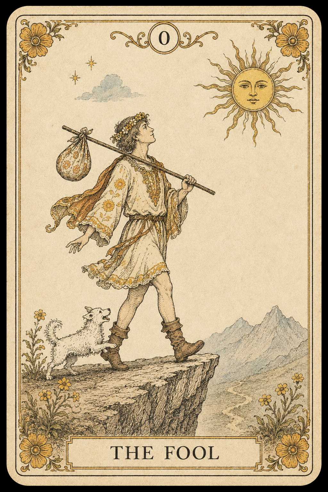

뒷면은 대칭 패턴 한 장이면 됩니다.

```prompt
빈티지·신비로움 분위기, 정면 대칭, 2:3 비율, 베이지 종이 톤 + 갈색 라인 드로잉, 중세 일러스트.
인물과 풍경은 넣지 마세요.
좌우·상하가 모두 대칭인 기하학적 장식 패턴으로만 채워 주세요.
프레임 정중앙에 작은 ✦ 엠블럼 한 점만 놓아 주세요.
```

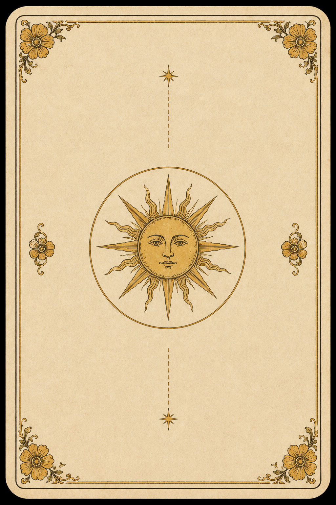

<!-- Unit A-4: 절 1 — 마이너 슈트 4종 대표 카드 5장 -->

### 슈트 네 가족과 메이저 한 장

| 슈트 | 대표 카드 | 프레임 |
|---|---|---|
| 메이저 | 바보 | 골드 |
| 컵 | 컵 에이스 | 장미 분홍 |
| 지팡이 | 지팡이 에이스 | 따뜻한 갈색 |
| 검 | 검 에이스 | 차가운 회청 |
| 펜타클 | 펜타클 에이스 | 잎 녹색 |

한 채팅창에서 한 장씩 받으십시오.

```prompt
빈티지·신비로움 분위기, 정면 대칭, 2:3 비율, 베이지 종이 톤 + 갈색 라인 드로잉, 중세 일러스트.
다음 다섯 장을 한 채팅창에서 한 장씩 차례로 출력해 주세요.
1) 바보 — 절벽 끝 젊은이, 작은 봇짐, 하얀 강아지. 프레임 골드.
2) 컵 에이스 — 잔에서 솟는 물줄기, 위로 내려오는 비둘기. 프레임 장미 분홍.
3) 지팡이 에이스 — 새 잎 돋은 지팡이, 떠 있는 구름. 프레임 따뜻한 갈색.
4) 검 에이스 — 왕관 쓴 검, 월계수 가지. 프레임 차가운 회청.
5) 펜타클 에이스 — 별 무늬 동전, 너머의 정원. 프레임 잎 녹색.
다섯 장 모두 본체 색감과 라인은 베이지·갈색 한 결로 통일해 주세요.
```

<!-- Unit A-4b: 절 1 — 메이저 대표 추가 3장 -->

### 메이저 대표 — 마법사·연인·세계

```prompt
빈티지·신비로움 분위기, 정면 대칭, 2:3 비율, 베이지 종이 톤 + 갈색 라인 드로잉, 중세 일러스트.
카드 이름: 마법사(The Magician).
핵심 상징: 작업대 위 컵·동전·검·지팡이 네 도구, 머리 위 무한대(∞) 표시, 한 손 위 한 손 아래.
주요 요소가 한 프레임 안에 정면으로 보이도록 배치해 주세요.
```

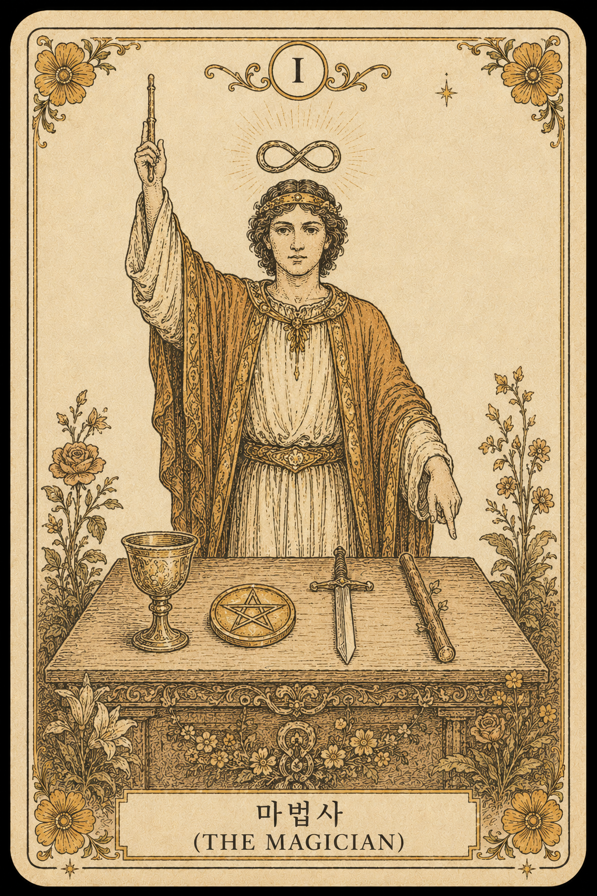

```prompt
빈티지·신비로움 분위기, 정면 대칭, 2:3 비율, 베이지 종이 톤 + 갈색 라인 드로잉, 중세 일러스트.
카드 이름: 연인(The Lovers).
핵심 상징: 위에서 두 팔 벌린 천사, 아래 정면 남녀 두 사람, 왼쪽 사과나무에 뱀, 오른쪽 불꽃 나무.
```

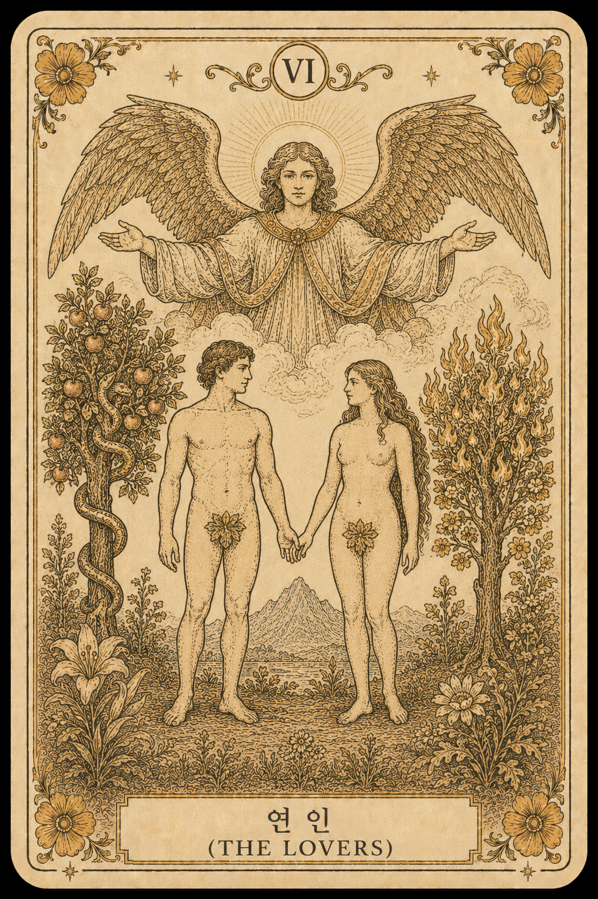

```prompt
빈티지·신비로움 분위기, 정면 대칭, 2:3 비율, 베이지 종이 톤 + 갈색 라인 드로잉, 중세 일러스트.
카드 이름: 세계(The World).
핵심 상징: 큰 월계관 화환 안 천을 두른 무희, 화환 네 모서리에 사람·사자·소·독수리.
```

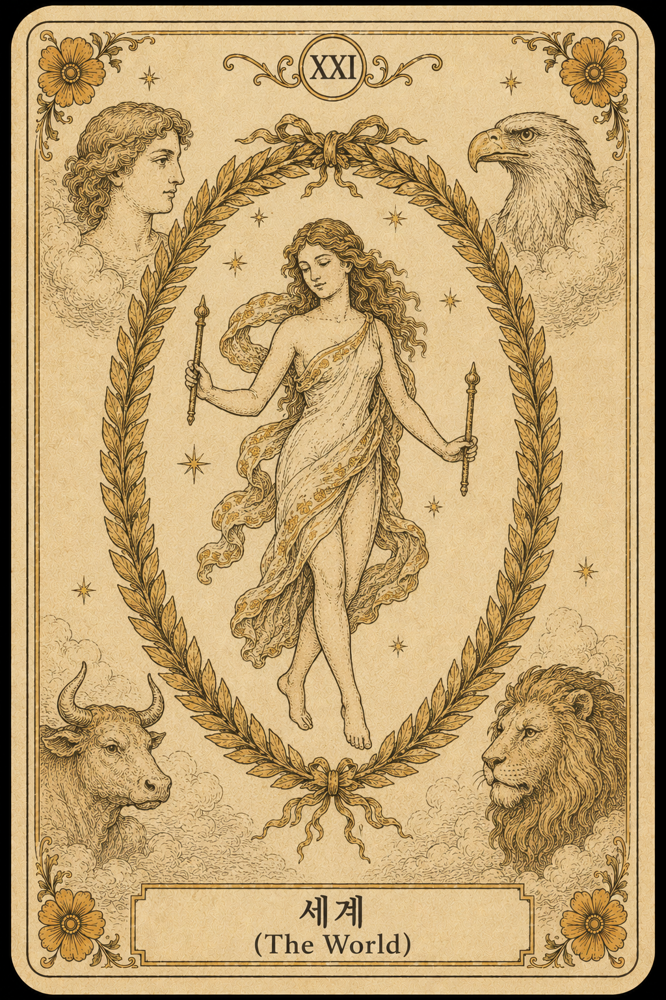

<!-- Unit A-5: 절 1 — 78장 확장 템플릿 -->

### 남은 73장을 받는 페이스

다섯 장씩 끊어 받으십시오.
이름과 핵심 상징만 갈아 끼우면 됩니다.

```prompt
빈티지·신비로움 분위기, 정면 대칭, 2:3 비율, 베이지 종이 톤 + 갈색 라인 드로잉, 중세 일러스트.
다음 다섯 장을 한 채팅창에서 한 장씩 차례대로 출력해 주세요.
1) 카드 이름: ___ . 핵심 상징: ___, ___, ___. 프레임 색: ___.
2) 카드 이름: ___ . 핵심 상징: ___, ___, ___. 프레임 색: ___.
3) 카드 이름: ___ . 핵심 상징: ___, ___, ___. 프레임 색: ___.
4) 카드 이름: ___ . 핵심 상징: ___, ___, ___. 프레임 색: ___.
5) 카드 이름: ___ . 핵심 상징: ___, ___, ___. 프레임 색: ___.
다섯 장 모두 카드 본체 색감과 라인은 베이지·갈색 한 결로 통일해 주세요.
```

<!-- p25 — Unit A-6: 절 1 — 끊긴 응답 합치기 + 슈트 어휘 -->

### 응답이 끊겼을 때 한 묶음으로 살리는 자리

다섯 장 받는 도중에 응답이 길어 중간에서 끊기는 자리가 나옵니다.
입력창에 **"계속"** 한 단어만 보내시면 끊긴 자리에서 이어 받으실 수 있습니다.
앞 응답 뒤에 이어 받은 글을 그대로 붙이시면 한 묶음으로 살아납니다.

> **슈트(suit) 어휘** — 한 벌 카드의 가족 단위입니다. 컵·지팡이·검·펜타클 네 가족이 마이너 56장을 이룹니다.

<!-- p27 — Unit A-7: 절 1 끝 자가 점검 -->

> **[절 1 끝 점검]** 카드 78장 한 벌이 한 폴더에 모이셨는지 짚으십시오. 모이지 않은 자리가 있으시면 같은 부탁말로 빠진 카드만 다시 받으시면 됩니다.

<!-- Unit B-1: 절 2 — 부분 수정 prompt -->

## 2. 이미지 수정 프롬프트로 카드 퀄리티 다듬기

결이 어긋난 카드가 한두 장 섞여 나옵니다.
**마음에 드는 부분은 그대로 둔다** 한 줄을 부탁말에 박으십시오.

손댈 칸은 한 번에 하나입니다.
색감 / 구도 / 디테일 / 통일성 가운데 하나만 짚으십시오.

```prompt
방금 받은 바보 카드에서 색감 한 칸만 다듬어 주세요.
지금 베이지가 너무 노랗게 떠오릅니다. 조금 더 차분한 종이 톤(미색에 가까운 베이지)으로 바꿔 주세요.
프레임 두께와 장식, 인물의 자세, 봇짐과 강아지 위치는 모두 그대로 유지해 주세요.
```

```prompt
방금 받은 묶음의 세 번째 카드(지팡이 에이스)에서 프레임 한 칸만 다듬어 주세요.
같은 묶음의 다른 네 장과 비교해 보면 이 한 장만 테두리가 두껍게 나왔습니다.
다른 네 장의 가는 갈색 라인 프레임 결에 맞추어 같은 두께로 다시 둘러 주세요.
인물의 자세, 새 잎 돋은 지팡이와 구름, 베이지·갈색 색감은 모두 그대로 유지해 주세요.
```

유지할 자리는 빠짐없이, 손댈 자리는 한 칸만 — 이 둘이 수정 부탁말의 골격입니다.

<!-- p30 — Unit C-0: 절 3 시작 — 메모장 한 파일 저장 6단계 -->

## 3. 화면 요구사항을 말로 설명해서 타로 사이트 만들기

### 절 3 시작 — 메모장에 받은 코드를 한 파일로 저장하기

이 절부터는 ChatGPT 에서 받으신 한 묶음 코드를 메모장에 옮겨 한 파일로 저장하시게 됩니다.
저장 결이 어긋나면 더블클릭해도 사이트가 열리지 않습니다.
아래 여섯 단계를 한 번에 짚으십시오.

1. 메모장(노트패드)을 켭니다.

<!-- 이미지: p030a_ch2_sec3_memo_save_step1.png — 사장님 직접 영역 -->

2. ChatGPT 응답 한 묶음을 통째 복사해 메모장 안에 붙여 넣습니다.

<!-- 이미지: p030b_ch2_sec3_memo_save_step2.png — 사장님 직접 영역 -->

3. 위 메뉴 「파일 → 다른 이름으로 저장」을 누릅니다.

<!-- 이미지: p030c_ch2_sec3_memo_save_step3.png — 사장님 직접 영역 -->

4. 「파일 형식」을 「모든 파일」로 바꿉니다.

<!-- 이미지: p030d_ch2_sec3_memo_save_step4.png — 사장님 직접 영역 -->

5. 파일 이름을 정확히 index.html 로 적습니다 (확장자가 .txt 가 아니라 .html 이어야 더블클릭 시 브라우저가 엽니다).

<!-- 이미지: p030e_ch2_sec3_memo_save_step5.png — 사장님 직접 영역 -->

6. 저장 폴더를 정한 뒤 「저장」을 누릅니다.

<!-- 이미지: p030f_ch2_sec3_memo_save_step6.png — 사장님 직접 영역 -->

여기까지 마치시면 받으신 코드가 한 파일로 자리 잡습니다. 이후 절 3 의 모든 자리는 같은 파일에 받으신 코드를 덮어쓰며 흐름이 이어집니다.

<!-- Unit C-1: 절 3 오프너 — SPA 4화면 흐름 -->

만들 사이트는 자리 네 개입니다.
한 페이지짜리 사이트입니다.

| 자리 | 한 줄 주소 | 하는 일 |
|---|---|---|
| 홈 | #/home | 주제 다섯 종 + 미리보기 한 장 |
| 질문 | #/ask/{주제} | 궁금한 것 적기 + 예시 셋 |
| 카드 뽑기 | #/spread/{주제} | 78장에서 세 장 뽑기 |
| 결과 | #/result | 카드 셋 + 풀이 |

네 자리를 하나씩 끊어 ChatGPT 에 받으십시오.

<!-- p31 — Unit C-1b: 절 3 — 해시 라우팅 한 단락 -->

#### 사이트 안 자리 이름은 # 뒤에 적힙니다

# 은 도서관 한 건물 안 책장 번호와 같습니다. 건물(사이트) 한 동에 책장(자리)이 여러 칸 있습니다. 한 페이지짜리 사이트가 인터넷에 다시 부탁하지 않고도 손님 화면 안에서만 자리를 갈아끼우며 여러 화면을 보여드리는 결입니다. 자리 명패는 #/home(들어가는 첫 자리), #/ask/love(질문 자리), #/spread/love(카드 펼치는 자리), #/result(결과 자리), #/history(이력 자리) 결로 적힙니다.

<!-- Unit C-2: 절 3 — 홈 화면 prompt -->

### 첫 자리 — 홈 화면 받기

새 채팅창을 펴 주십시오.

```prompt
모바일에서 잘 보이는 한 페이지짜리 타로 사이트의 홈 화면을 만들어 주세요.
코드·CSS·자바스크립트·데이터 모두 한 파일에 담아서 한 묶음으로 주세요.
주제 데이터·카드 78장 정보·풀 해석 데이터는 다음 자리에서 더 받습니다.
상단 헤더: 좌측에 ✦ + "VIBE TAROT" 브랜드 텍스트.
화면 가운데 H1: "오늘의 타로".
한 줄 안내: "주제를 골라 보세요. 78장 풀 카드에서 세 장을 직접 뽑습니다."
미리보기 박스: 카드 앞면 한 장(fool.png), 위에 작게 "PREVIEW · 빈티지 베이지·갈색 라인 톤 — 앞면".
다섯 종 주제 그리드(모바일 한 줄, 큰 화면 두 줄):
연애운 ❀ / 금전운 ◈ / 직업운 ✦ / 인간관계 ✸ / 오늘의 운세 ☀.
각 칸은 아이콘, 제목, 한 줄 요약 순.
색감: 배경 검붉은 갈색, 강조 머스타드 골드, 글자 베이지. 카드 앞면 안쪽만 베이지 종이 톤.
폰트: 제목 Times New Roman 계열 세리프, 본문 산세리프, 글자 간격 살짝 넓게.
푸터: "made with ChatGPT · vibe coding 입문서 예제".
```

프롬프트의 "세리프"는 글자 끝에 작은 가로 발이 달린 결, "산세리프"는 발이 없는 결입니다.

받은 코드를 메모장에 붙여 저장하십시오.
더블클릭하시면 화면이 열립니다.


> 주제 칸이 비어 있어도 정상입니다. 데이터는 다음 자리에서 받습니다.

<!-- Unit C-3: 절 3 — 5종 주제 데이터 분리 prompt -->

### 메뉴판 한 장 따로 받기

```prompt
방금 받은 홈 화면 코드는 그대로 두고, 다섯 종 주제 데이터를
같은 파일 안에 더해 주세요.
주제 한 종마다 일곱 가지: 1) 영문 식별 이름(love / money / work / relation / today),
2) 한국어 제목, 3) 아이콘 한 글자, 4) 한 줄 요약,
5) 안내 문구 한 줄, 6) 예시 질문 세 개, 7) 자리 라벨 세 개와 한 줄 힌트.
자리 라벨: 연애운 ❀ — 초반/중반/후반. 금전운 ◈ — 수입/지출/결과.
직업운 ✦ — 현재/도전/결과. 인간관계 ✸ — 나/상대/관계. 오늘의 운세 ☀ — 과거/현재/흐름.
홈 화면이 이 파일을 읽어 다섯 종 주제 그리드를 채우도록 연결해 주세요.
```

받은 코드로 메모장을 덮어쓰고 더블클릭하시면 주제 칸이 채워집니다.

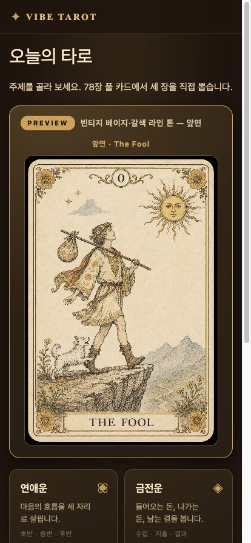

<!-- Unit C-4: 절 3 — 질문 화면 prompt -->

### 두 번째 자리 — 질문 화면 받기

```prompt
앞에서 받은 코드는 그대로 두고, 자리 한 개만 더해 주세요.
홈에서 주제 칸을 누르면 명패가 #/ask/{주제 영문 이름}으로 바뀌면서 질문 자리가 열립니다.
좌측 상단: 뒤로가기(←) + 주제 아이콘·제목.
한 줄 안내: "{한 줄 요약} 무엇이 궁금하신가요?"
세 줄 높이 글 입력 칸 한 개, 120자까지.
안내 문구는 해당 주제 첫 예시 질문으로 자동 채워 주세요.
"자주 묻는 질문" 묶음: 예시 질문 세 개를 작은 단추로. 단추를 누르면 입력 칸으로 옮겨집니다.
맨 아래 "카드 뽑으러 가기 →" 단추.
입력 칸이 비어 있으면 첫 예시 질문이 자동 사용됩니다.
색감·폰트는 홈 화면과 같은 결로 통일.
```

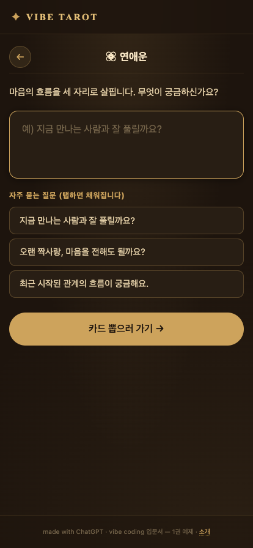

<!-- Unit C-5: 절 3 — 카드 뽑기 화면 prompt -->

### 세 번째 자리 — 카드 뽑기 화면

이 사이트의 심장입니다.
78장이 가로로 흩뿌려져 있습니다.
한 장을 누르면 빈 자리로 날아가 뒷면이 앞면으로 회전합니다.
세 장이 모일 때까지 반복됩니다.

```prompt
앞에서 받은 코드는 그대로 두고, 카드 뽑기 자리 한 개만 더해 주세요.
질문 자리에서 "카드 뽑으러 가기"를 누르면 명패가 #/spread/{주제 영문 이름}으로 바뀌며 열립니다.
카드 정보는 다음 자리에서 받고, 지금 단계는 모두 뒷면 모양으로만.
화면 진입 시 순서를 새로 섞고, 각 카드는 50% 확률로 정·역.
화면 위쪽: 뒤로가기(←), 주제 아이콘·제목, "1 / 3" 진행 단계. 아래 박스에 손님 질문.
가운데 빈 자리 셋(점선 테두리), 자리마다 이름과 한 줄 힌트.
안내: "{첫 자리 이름} 자리에 놓을 카드를 골라 주세요." 아래 "🔀 카드 다시 섞기" 단추.
아래쪽에 78장 가로 부채꼴(fan), ±3° 회전, 가로 스크롤.
한 장을 누르면 흩뿌림에서 흐려지고, 같은 카드가 위로 떠올라 첫 빈 자리로 0.7초 동안 날아가 닿는 순간 뒷면→앞면 회전.
안내 문구는 다음 자리 이름으로 갱신. "카드 다시 섞기"는 안 뽑힌 카드만 섞습니다.
세 장 모이면 1.2초 뒤 #/result 로 자동 이동. 모바일도 같은 동작.
```

코드가 잘려 돌아오면 **"전체 파일을 한 덩어리로 다시 주세요."** 라고 보내 주십시오.

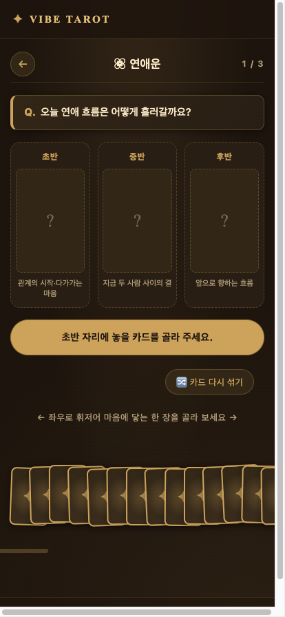

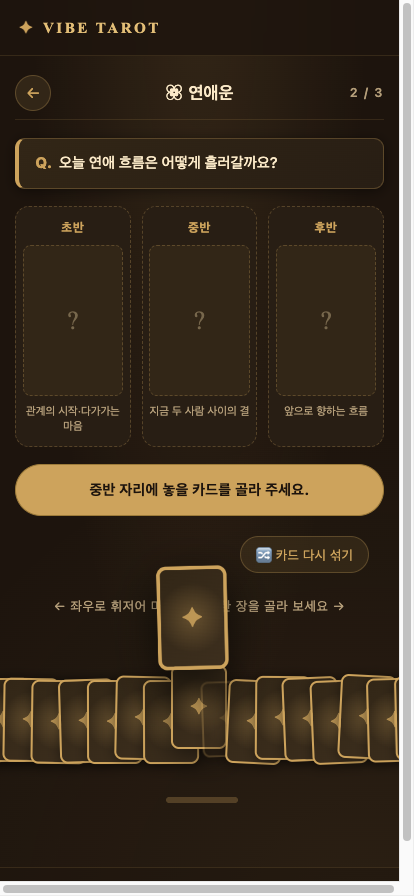

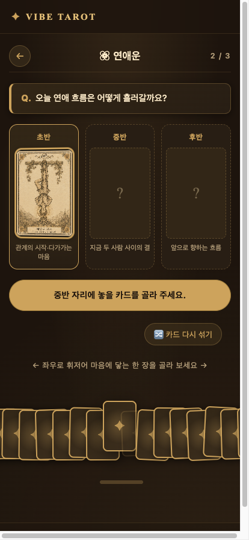

<!-- Unit C-6: 절 3 — 78장 카드 데이터 분리 prompt -->

### 카드 정보 한 장 따로 받기

```prompt
방금 받은 카드 뽑기 자리 코드는 그대로 두고, 78장 카드 정보를
같은 파일 안에 더해 주세요.
이 파일에는 일흔여덟 장 카드 정보가 차례로 담깁니다.
카드 한 장의 정보는 여덟 가지: 1) 영문 식별 이름(소문자), 2) 영문 카드 이름,
3) 한글 카드 이름, 4) 카드 번호, 5) 슈트 분류(major / cups / wands / swords / coins),
6) 카드 그림 파일 경로(images/{영문 식별 이름}.png),
7) 정방향 한 줄 메시지, 8) 역방향 한 줄 메시지.
메이저 22장은 바보(0)부터 세계(XXI)까지 차례로 담아 주세요.
마이너 56장은 네 슈트별 14장씩, 각 슈트마다 에이스(A) / 2 ~ 10 /
시동(P) / 기사(K) / 여왕(Q) / 왕(KG) 순서로 담아 주세요.
슈트별 톤은 컵 = 마음·물, 지팡이 = 의지·불, 검 = 생각·바람, 펜타클 = 현실·흙.
정·역 한 줄 메시지는 "오늘 하루를 따뜻하게 짚어 주는 한 문장" 톤.
카드 그림 파일이 없으면 카드 이름·번호·슈트 기호로 자동 대체해 주세요.
카드 뽑기 자리가 이 파일을 읽어 채우도록 연결해 주세요.
```

프롬프트의 인물 카드 약어는 P(시동, Page), K(기사, Knight), Q(여왕, Queen), KG(왕, King) 결입니다.

끊겨 돌아오면 **"끊긴 자리에서 이어서 출력해 주세요"** 라고 보내 주십시오.

받은 코드로 메모장을 덮어쓰면 78장이 자리 잡습니다.

<!-- p39 — Unit C-7: 절 3 끝 자가 점검 -->

> **[절 3 끝 점검]** 첫 화면이 휴대전화에서 떠올랐는지 짚으십시오. 떠오르지 않으시면 저장하신 파일 확장자가 정확한지, 같은 폴더에 받으신 파일이 다 모여 있는지 다시 살피십시오.

<!-- Unit D-1: 절 4 오프너 + 결과 화면 prompt -->

## 4. 조건을 넣어 타로 리딩 결과 만들기

결과는 네 층입니다.

1) **흐름** 한 줄.
2) **자리별 풀이** 세 블록.
3) **패턴 진단** 한 줄.
4) **자세한 풀이** 다섯 문장.

풀이는 정·역 조합 아홉 갈래 가운데 하나로 갈라집니다.

```prompt
방금 만든 카드 뽑기 자리 코드는 그대로 두고, 결과 화면 한 개만 더해 주세요.
세 자리에 카드 세 장이 모이면 #/result 로 바뀌며 결과 화면이 떠오릅니다.
다섯 부분:
1) 머리 줄: 왼쪽 ← 홈 단추, 오른쪽 주제 아이콘 + "○○ 리딩".
2) 질문 박스: "Q. ○○○" 인용.
3) 카드 세 장 가로 + 자리 라벨. 누르면 모달이 떠오를 자리.
4) 종합 해석 박스:
   - "흐름" + "{초반} {카드1}({정/역}) → {중반} {카드2}({정/역}) → {후반} {카드3}({정/역})" 한 줄.
   - 자리별 풀이 세 블록: 자리 라벨 / 카드 한글 이름 / 정·역 배지 / 한 줄 메시지.
   - "풀이" 다섯 문장: ① 흐름 요약 ② 정·역 조합 아홉 갈래 해당 한 줄 ③ 초반·중반 이어짐 ④ 후반 강조 ⑤ 후반 자세한 메시지.
5) 액션: "카카오톡 공유"(절 7) / "같은 주제 다시" / "다른 주제".

② 자리에 들어갈 정·역 조합 아홉 갈래:
- 모두 정: 순하게 풀려 가는 시기. - 모두 역: 한 박자 쉬어 가는 결.
- 첫 자리만 역: 시작은 막혔지만 풀려 가는 흐름. - 마지막만 역: 마지막이 엇갈리는 자리.
- 초·중 역 후 정: 마지막에 길이 열리는 흐름. - 첫 정 후 역: 중간부터 흔들리는 자리.
- 가운데만 역: 중간 한 번이 흔들리는 자리. - 첫·끝 역, 가운데 정: 중간만 잠시 풀리는 흐름.
- 그 외 섞임: 정·역이 한 자리에 섞인 흐름.

톤 한국어 존댓말, "오늘 하루의 결을 짚어 주는 따뜻한 한 마디". 색감 검붉은 갈색 + 머스타드 골드.
```

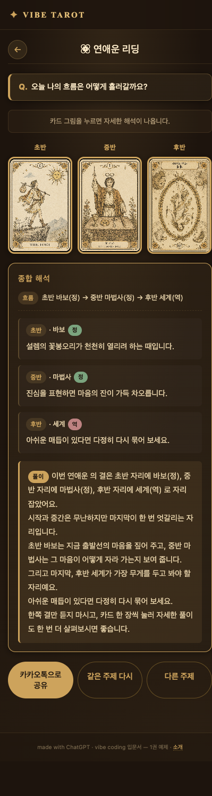

<!-- Unit D-2: 절 4 — 카드 모달 + 데이터 분리 prompt -->

### 카드 한 장을 더 깊이 — 모달 한 자리

카드를 누르면 네 영역 풀이가 정·역 양쪽으로 펼쳐지는 모달을 더합니다.

```prompt
방금 만든 결과 화면 코드는 그대로 두고, 카드 한 장 모달 자리만 더해 주세요.
배경 전체에 어두운 반투명 막, 그 위 가운데 박스 한 장이 떠오릅니다.
박스 안 위에서 아래로:
1) 누른 카드 한 장(큰 사이즈) + 자리 라벨,
2) 카드 한글·영문 이름 + 카드 번호,
3) 자리 힌트 한 줄, 4) 자리 메시지 한 줄, 5) 정·역 배지,
6) 네 영역 풀 해석: 연애 / 재물 / 직업 / 관계 네 줄, 영역마다 정·역 한 줄씩.

닫기: ✕ 단추 / ESC 키 / 박스 바깥 클릭.

네 영역 풀 해석은 다음 자리에서 받습니다.
```

자료에는 다섯 자리가 키로 들어갑니다.
모달은 그 가운데 네 영역만 보여 줍니다.

```prompt
방금 받은 카드 모달은 그대로 두고, 카드 한 장 풀 해석 묶음을
같은 파일 안에 더해 주세요.

카드 한 장 풀 해석 묶음:
- 카드 식별 이름(영문 소문자, 앞 자리에서 정한 이름)을 키로,
- 다섯 자리(general / love / money / work / relation)를 자리로,
- 자리마다 정·역 한 줄 짝으로.

이번 부탁은 메이저 22장만. 바보(0)부터 세계(XXI)까지,
한 장당 다섯 자리 × 정·역 = 열 줄, 합 220줄.
마이너 56장은 같은 모양으로 슈트마다 한 번씩 네 번에 나누어 받습니다.

톤은 한국어 존댓말, 사십~육십 자, "오늘 하루의 결을 짚어 주는 따뜻한 한 마디".
어미는 "~해 보세요" / "~한 시기입니다".
```

```prompt
방금 받은 메이저 22장과 같은 모양으로
{슈트 이름: 컵 / 지팡이 / 검 / 펜타클} 14장을 이어 주세요.
다섯 자리(general / love / money / work / relation), 자리마다 정·역 한 줄 짝.
톤은 메이저와 같은 결, 사십~육십 자, 따뜻한 한 마디 어미.
```

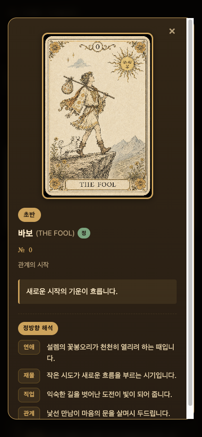

<!-- Unit D-3: 절 4 — 마무리 -->

풀이 톤이 어긋나면 **"조금 더 부드럽게"** 한 마디만 보내 주십시오.

> **[주의]** AI 풀이는 참고용입니다. 의료·금융·법률 결정 근거로 받지 마십시오.

브라우저를 닫으면 결과가 사라집니다.
다시 살리는 자리는 다음 절입니다.
