<!-- Chapter 2 dogfood 역산 v3 draft (part2: 절 5~8 + 마무리) -->

<!-- Unit E-1: 절 5 — 오늘 결과 자정까지 + 이력 5건 prompt -->

## 5. 기능 요구사항을 말로 설명해서 결과 저장 만들기

새로고침을 누르면 카드 세 장이 사라집니다.
사이트가 오늘 결과를 기억하지 못합니다.

두 가지 약속을 더합니다.
첫째, 오늘 결과를 자정까지 둡니다.
둘째, 최근 다섯 번 결과를 이력으로 모읍니다.

> **[비유]** 칠판은 닫으면 지워집니다. 브라우저 안 작은 노트는 닫아도 남습니다.

저장은 손님 브라우저 안에만 들어갑니다.
서버로 올라가지 않습니다.

저장 자리는 두 칸입니다.
오늘 한 묶음, 최근 다섯 건 이력입니다.

```prompt
앞에서 받은 코드는 그대로 두시고, 결과 화면 도달 자리에서 두 가지 저장 자리를 더해 주세요.
첫 번째(키: vibe_tarot_today): 오늘 결과 한 묶음 + 오늘 날짜(YYYY-MM-DD).
결과 화면 진입 시 저장 날짜가 오늘과 같으면 카드 세 장과 종합풀이를 다시 보여 주고,
다르면(자정 지난 경우) 무시하고 처음 화면으로 돌려보내 주세요.
두 번째(키: vibe_tarot_history): 최근 다섯 건 이력. 새 결과는 맨 앞에 끼워 넣고, 여섯 번째부터 자동으로 빠집니다.
홈 화면 위쪽에 "오늘 뽑은 결과 다시 보기" 단추 — 첫 번째 저장이 오늘 자리일 때만 떠오릅니다.
새 자리 명패 #/history. 이력 다섯 건이 위에서 아래로.
한 건마다: 주제 아이콘·제목, 뽑은 시간(오늘 14:30 · 5/8 22:10), 한 줄 질문, 카드 세 장 한글 이름·정역.
이력이 없으면 "아직 기록이 없습니다. 한 번 뽑아 보세요." 한 줄.
```

받은 코드로 메모장을 덮어쓰고 더블클릭하십시오.
같은 날에는 새로고침을 눌러도 카드 세 장이 떠오릅니다.
자정이 지나면 저장은 비워집니다.

자정이 지난 다음 접속 시 사이트가 저장 날짜를 짚어 오늘이 아니면 그 묶음을 무시하고 처음 화면으로 돌아갑니다.
이력 다섯 건은 그대로 남아 #/history 자리에서 짚으실 수 있습니다.


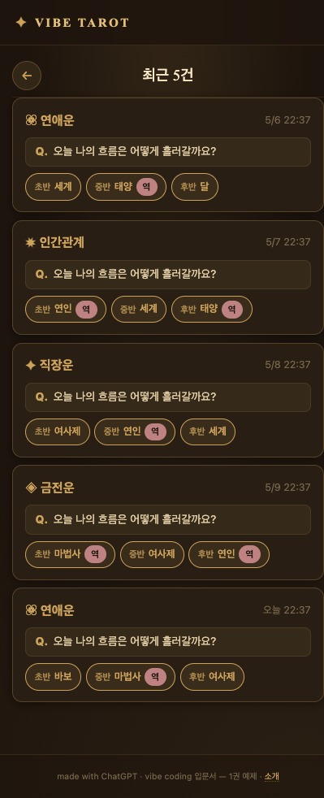

<!-- Unit E-2: 절 5 — 자가 점검 -->

저장은 세 가지로 점검하실 수 있습니다.

- F5 새로고침 후 카드 세 장이 같은 자리에 떠오르는지.
- #/history 자리에 방금 결과가 맨 위에 올라가 있는지.
- 자정을 넘긴 뒤 다시 열어 처음 화면으로 돌아오는지.

<!-- Unit F-1: 절 6 — F12 로 저장 데이터 확인 -->

## 6. F12 로 저장 데이터 확인하고 삭제하기

브라우저 안 살펴보는 자리(개발자 도구)로 저장을 확인하실 수 있습니다.
F12 한 번이면 새 창이 열립니다.

> **[비유]** F12 는 자동차 보닛 손잡이입니다. 한 번 열면 안쪽이 보입니다.

크롬·엣지에서 네 단계입니다.

**1. 사이트를 띄우고 F12 를 누릅니다.**
새 창이 열립니다.

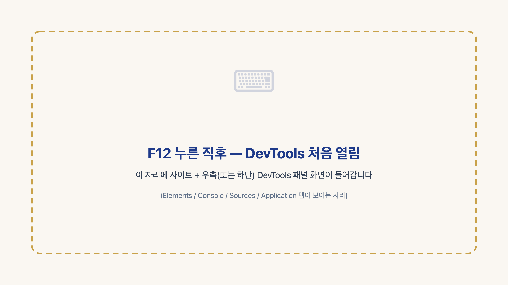

**2. 위쪽 차림표에서 Application 탭으로 옮깁니다.**
왼쪽에서 Storage → Local Storage → 사이트 주소 순으로 펴십시오.

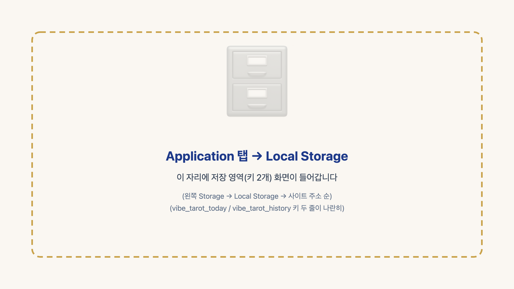

영문 라벨은 한글로 짚으면 길을 잃지 않으십니다.
Application 은 애플리케이션, Storage 는 저장 자리, Local Storage 는 이 브라우저 안 저장 자리입니다.

두 저장 자리가 vibe_tarot_today / vibe_tarot_history 키로 나란히 떠 있습니다.

**3. 키 이름을 누르시면 오른쪽에 값이 펼쳐집니다.**

JSON(제이슨, JavaScript Object Notation)은 키와 값 한 묶음 결로 저장 자리를 적은 글자 문서입니다.

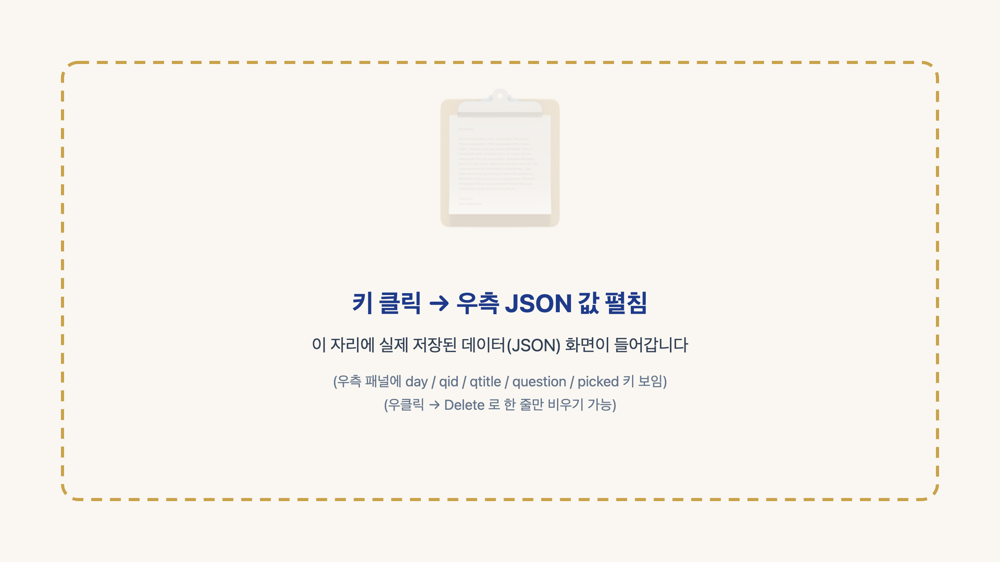

**4. 마우스 오른쪽 단추 → Delete 로 그 줄만 지웁니다.**
vibe_tarot_today 를 비우고 다시 열면 자정 동작과 같은 결입니다.

> **[주의]** 저장은 손님 브라우저 안에만 있습니다. 여러 손님 결과를 한 자리에 모으려면 서버와 여러 손님 자료 모으는 자리가 따로 필요합니다.

<!-- Unit G-1: 절 7 — 카카오톡 공유 -->

## 7. 카카오톡 공유 기능 만들기

결과 화면 단추 한 개로 카드 세 장이 카카오톡 대화창에 따라 나갑니다.
카카오에서 키 한 줄을 받아 사이트 머리에 끼워 두어야 합니다.

> **[비유]** 키 한 줄은 입구 신분증 확인입니다.

키 한 줄은 다섯 단계로 받으십시오.

**1. 카카오 디벨로퍼스 첫 자리에 들어가기.**
주소창에 developers.kakao.com 한 줄을 넣고 평소 쓰시는 카카오 계정으로 들어가십시오.

<!-- 이미지: p063_kakao_dev_step1.png — 사장님 직접 영역 -->

**2. 내 애플리케이션 → 애플리케이션 추가.**
위쪽 차림표에서 내 애플리케이션 자리로 옮겨 애플리케이션 추가 단추를 누르십시오.
앱 이름과 회사명 두 칸을 채우면 자리가 한 칸 만들어집니다.

<!-- 이미지: p063_kakao_dev_step2.png — 사장님 직접 영역 -->

**3. 만든 앱 들어가기 → JavaScript 키 한 줄 복사.**
방금 만든 앱 이름을 누르고 앱 키 자리로 옮기십시오.
네 줄 가운데 JavaScript 키 한 줄을 통째로 복사하시면 됩니다.

<!-- 이미지: p063_kakao_dev_step3.png — 사장님 직접 영역 -->

**4. 플랫폼 → Web → 사이트 도메인 등록.**
왼쪽 차림표에서 플랫폼 자리로 옮겨 Web 단추를 누르십시오.
배포 전에는 임시로 http://localhost(내 컴퓨터 안 임시 주소) 한 줄, 배포 뒤에는 GitHub Pages 주소로 갈아끼우시면 됩니다.

<!-- 이미지: p063_kakao_dev_step4.png — 사장님 직접 영역 -->

**5. 카카오 로그인 → 동의 항목.**
공유만 쓰시면 동의 항목 자리는 따로 손볼 자리가 없습니다.
들어가서 한 번 짚어 보고 그대로 빠져나오시면 됩니다.

<!-- 이미지: p063_kakao_dev_step5.png — 사장님 직접 영역 -->

```prompt
앞에서 받은 코드는 그대로 두시고, 결과 화면 액션 영역의
"카카오톡으로 공유" 단추가 실제로 동작하도록 한 자리만 더해 주세요.

공유 문구:
"오늘의 {주제} — {자리1} {카드1}{정/역} / {자리2} {카드2}{정/역} / {자리3} {카드3}{정/역}
VIBE TAROT 에서 직접 뽑아 보세요."

카카오 SDK 가 초기화돼 있으면 Kakao.Share.sendDefault 로 공유창을 띄우고,
닿지 않으면 navigator.share 로 같은 문구를 넘겨 주세요.
둘 다 닿지 않으면 alert 한 번으로 위 문구를 띄워 직접 복사해 보낼 수 있게 부탁드립니다.

카카오 SDK 키 자리는 YOUR_KEY 그대로 두세요.
developers.kakao.com 에서 받은 JS 키로 직접 갈아끼우는 자리입니다.
```

받은 코드를 메모장에 붙이신 뒤 메모장 위쪽 차림표에서 편집 → 찾기(또는 Ctrl+F)를 누르고 YOUR_KEY 한 단어를 찾아, 카카오에서 받은 JS 키 한 줄로 갈아끼우십시오.

안전망 세 자락입니다.

1. 키가 있으면 카카오톡 공유창이 뜹니다.
2. 카카오가 닿지 않으면 휴대전화 기본 공유창이 같은 문구를 띄웁니다.
3. 그 자리도 닿지 않으면 안내 창이 같은 문구를 띄웁니다.

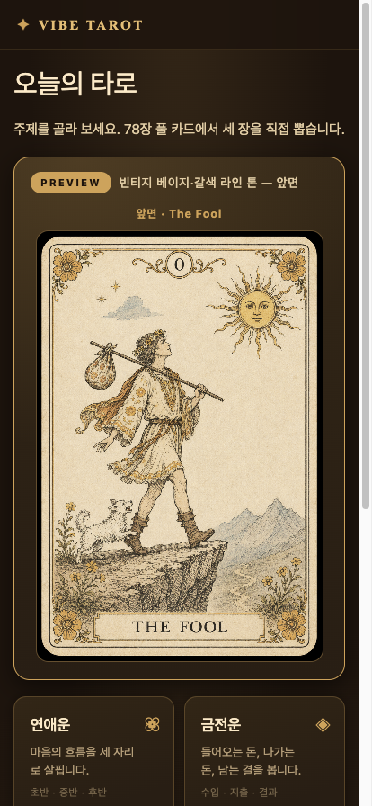

> **[주의]** 카카오톡 공유창은 developers.kakao.com 에서 키를 받아 YOUR_KEY 자리에 끼워 넣어야 열립니다.

<!-- Unit H-1: 절 8 — GitHub Pages 배포 -->

## 8. GitHub Pages 배포와 도메인 연결

손님이 휴대전화로 열어 보시려면 사이트가 인터넷에 자리 잡아야 합니다.
무료로 빌려 주는 곳이 **GitHub Pages** 입니다.

> **[비유]** GitHub Pages 는 공유 식당 한 칸입니다. 임대료 0원.

### (1) GitHub 가입 — 처음 오시는 분

GitHub 첫 자리입니다.
이메일·비밀번호·사용자 이름 세 칸을 채워 주십시오.

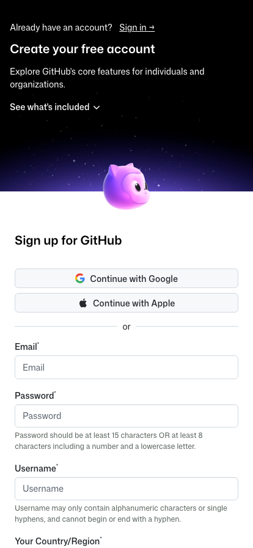

> **[실무 팁]** 사용자 이름은 영문 소문자·숫자만, 짧게 두십시오. 사이트 주소에 그대로 들어갑니다.

### (2) GitHub 로그인 — 이미 계정이 있는 분

이미 계정이 있으시면 사용자 이름과 비밀번호 두 칸으로 로그인하십시오.

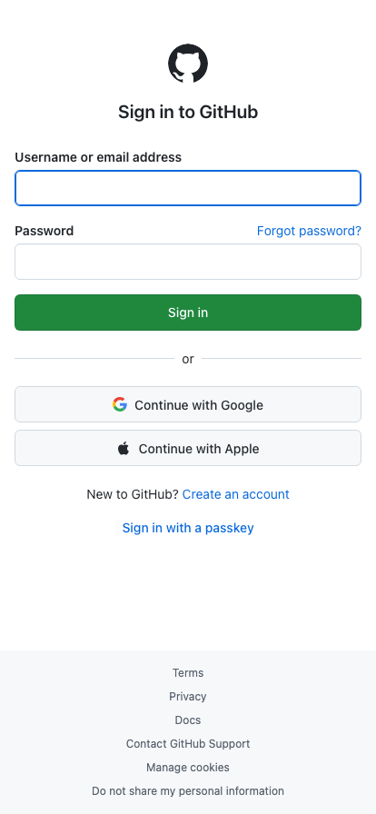

### (3) 새 저장소 만들기

오른쪽 위 **+ → New repository** 를 눌러 주십시오.
저장소 이름은 vibe-tarot, **Public**, 자동 생성 자리는 비워 두십시오.

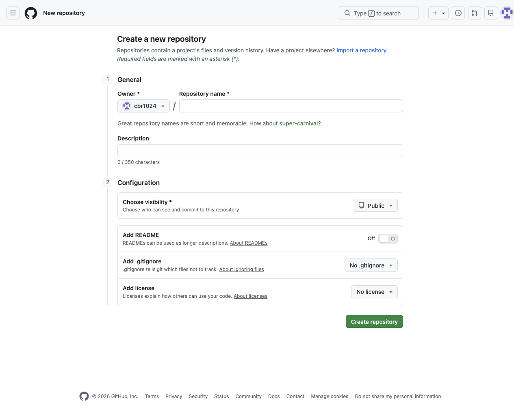

### (4) 폴더 통째로 올리기

저장소 화면 가운데 "uploading an existing file" 링크를 눌러 주십시오.

<!-- 이미지: p072_ch2_sec8_upload_files_link.png — 사장님 직접 영역 -->

손에 한 묶음을 모으십시오.

- 메모장에서 저장하신 한 파일 (절 3 에서 만드신 파일)
- 카드 79장 PNG 가 든 images 폴더 한 개 (절 1 다운로드 길 또는 직접 만드신 자리)

두 자리를 한 번에 끌어다 놓고 "Commit changes" 단추를 눌러 주십시오.

<!-- 이미지: p072b_ch2_sec8_drag_and_commit.png — 사장님 직접 영역 -->

### (5) Pages 활성화

저장소 화면을 새로고침하시고 **Settings → Pages** 로 들어가 주십시오.
**Source** 는 Deploy from a branch 로 두십시오.
**Branch** 는 main / (root) 두 칸을 짝으로 고른 뒤 **Save** 입니다.

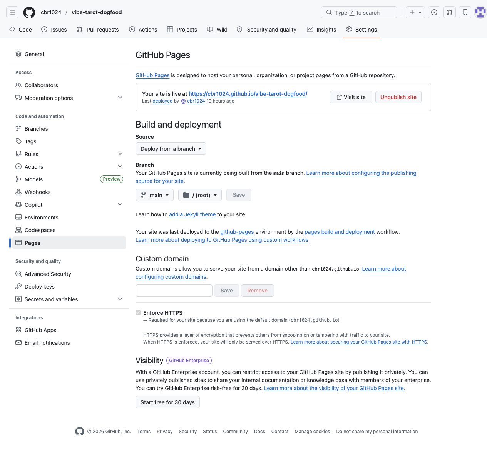

### (6) 주소 받기

1~2분 기다리시고 같은 화면을 다시 열어 보십시오.
"Your site is live at https://{사용자이름}.github.io/vibe-tarot/" 한 줄이 떠오릅니다.

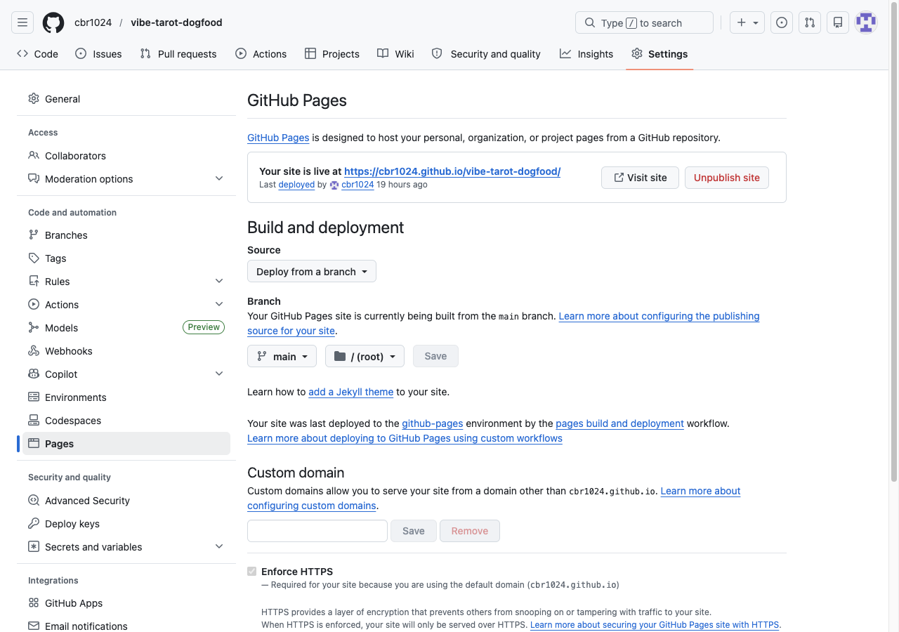

### (7) 모바일에서 확인

주소 한 줄을 휴대전화 주소창에 넣으십시오.
사이트가 떠오르면 배포 끝입니다.
화면이 깨지면 파일 이름 대소문자를 짚으십시오.

자주 막히는 자리는 세 군데입니다.
Pages 주소가 1~2분 지나도 빈 자리면 Settings → Pages 자리를 다시 여십시오.
Branch 자리가 main / (root) 로 박혔는지 한 번 더 짚으십시오.

카드 그림이 안 떠오르면 images 폴더가 같이 올라갔는지 짚으십시오.
개발자 도구 Console 자리에 404 가 떠오르면 파일 이름 대소문자 차이를 짚으십시오.

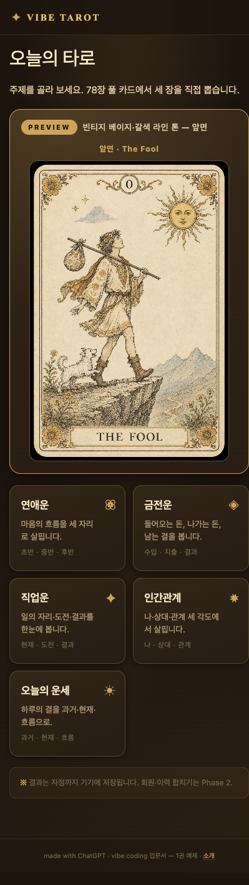

> **[확인]** https://{사용자이름}.github.io/vibe-tarot/ 를 휴대전화로 열어 사이트가 떠오르면 통과입니다. **[팁]** 다음에 한 줄 고치실 때는 저장소 화면에서 파일을 누르고 연필 아이콘으로 손보시면 됩니다.

---

<!-- Unit Z-1: 챕터 마무리 -->

---

<!-- p82 — 부록 A: 자산 저장소 다시 보기 -->

## 부록 A. 다음 단계 안내

### A-1. 자산 저장소 다시 보기

자산 저장소 자리는 https://github.com/cbr1024/vibe-tarot-assets 입니다.
images 폴더에 카드 79장 PNG 가 들어 있고, prompts 묶음 한 자리에 ChatGPT 부탁말 10 묶음이 모여 있습니다.
책에서 사용한 그대로의 자료가 모여 있는 자리입니다.

<!-- 이미지: p082_appendix_a_assets_repo.png — 사장님 직접 영역 (자산 저장소 GitHub 화면 캡처). 캡션: "https://github.com/cbr1024/vibe-tarot-assets — 다운로드 길 시작 자리". -->

<!-- p83 — 부록 A: 참고 사이트 영감 -->

### A-2. 참고 사이트 영감

책의 디자인·기능 영감 출처는 https://tarotpark.com/m/tarot/category.php 한 자리입니다.
빈티지 베이지·갈색 라인 톤, 78장 한 벌, 모바일 한 손 흐름이 한 자리에 모여 있는 사이트입니다.
캡처는 박지 않고 영감 안내 한 줄만 두었습니다.

<!-- p84 — 부록 A: 다음 책 예고 + 마침 -->

### A-3. 마침

여기까지 절 1 부터 절 8 까지 한 손에 닿으셨습니다.
다음 책에서는 카드 한 벌 너머 — 손님 한 분 한 분 결과를 서버 한 자리에 모으는 길을 다룰 자리입니다.
같이 만들어 보겠습니다.
